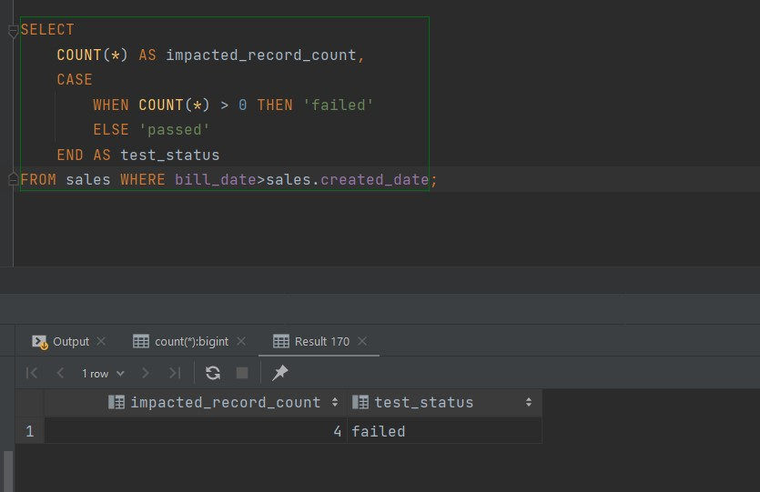

# Query Based Validation 
Preparong four test cases for each of the following tables with test script too.
- Employee
- Timesheet
- Product
- Sales

The steps are listed hereafter.

## For Employee Table


#### 1. Checking if employees punch in to their right department or not.
```sql
SELECT
    COUNT(*) AS impacted_record_count,
    CASE
        WHEN COUNT(*) > 0 THEN 'failed'
        ELSE 'passed'
    END AS test_status
FROM (
select
   e.client_employee_id ,e.department_id, t.department_id
 from employee e inner join timesheet t on e.client_employee_id = t.employee_id
group by e.client_employee_id, e.department_id, t.department_id
having e.department_id <> t.department_id) tmp;
```


#### 2. Checking if all are assigned to at least one employee.
```sql
SELECT
    COUNT(*) AS impacted_record_count,
    CASE
        WHEN COUNT(*) > 0 THEN 'failed'
        ELSE 'passed'
    END AS test_status
FROM employee t
WHERE role='Manager' AND client_employee_id NOT IN(
	select distinct manager_emp_id from employee where manager_emp_id is not null
);
```


#### 3. Check if all the employees above 60 years of age are still working on lower salary
Let us assume that the salary below 5000 are considered as low

```sql
SELECT count(*) AS impacted_record_count,
    CASE
        WHEN COUNT(*) > 0 THEN 'failed'
        ELSE 'passed'
    END AS test_status FROM (
                                SELECT EXTRACT(YEAR from AGE(CURRENT_DATE, dob)) as "age", client_employee_id, salary
                                FROM employee
                                WHERE EXTRACT(YEAR from AGE(CURRENT_DATE, dob)) > 60
                                  AND salary < 5000
                            ) t;
```


#### 4. Checking if any employees earn greater than manager.
Condition: for an employee to earn as manager, the minimum salary is 10000
```sql
SELECT count(*) AS employees_count,
    CASE
        WHEN COUNT(*) > 0 THEN 'passed'
        ELSE 'failed'
    END AS test_status FROM (
SELECT * from employee
WHERE role <> 'Manager' AND salary>10000
  ) t;
```


## For Timesheet Table
#### 1. Check if the shift date is weekend and the number of team mates absent is present.
Here, we assume that the weekend is 6th and 7th date of week i.e. saturday and sunday
```sql
SELECT
    COUNT(*) AS impacted_record_count,
    CASE
        WHEN COUNT(*) > 0 THEN 'failed'
        ELSE 'passed'
    END AS test_status
FROM (
         SELECT *
         FROM timesheet
         WHERE EXTRACT(ISODOW FROM shift_date) IN (6, 7)
           AND num_teammates_absent > 0
     ) t;
```


#### 2. Check if absent employees are set on call.
```sql
SELECT
    COUNT(*) AS impacted_record_count,
    CASE
        WHEN COUNT(*) > 0 THEN 'failed'
        ELSE 'passed'
    END AS test_status
FROM (
         select *
         from timesheet
         where attendance = false and was_on_call = true
     ) t;
```


#### 3. check if any present employee have worked as half day (i.e. 5 hours) in a shift day.
```sql
SELECT count(*) AS employees_count,
    CASE
        WHEN COUNT(*) > 0 THEN 'failed'
        ELSE 'passed'
    END AS test_status FROM (
    select employee_id, sum(hours_worked) as total_work_hour, shift_date from timesheet group by employee_id, shift_date, attendance
    having attendance =  true and sum(hours_worked)=5 )t;
```


#### 4. Check whether the number of team mated absent includes every employees absent or not.
```sql
SELECT
    COUNT(*) AS impacted_record_count,
    CASE
        WHEN COUNT(*) > 0 THEN 'failed'
        ELSE 'passed'
    END AS test_status
FROM (
    select * from timesheet where attendance = false and num_teammates_absent=0
    )t;
```


## For Product Table
#### 1. Checking when discount is mentioned in product name but not applied in sales.
```sql
SELECT
    COUNT(*) AS impacted_record_count,
    CASE
        WHEN COUNT(*) > 0 THEN 'failed'
        ELSE 'passed'
    END AS test_status
FROM sales
WHERE discount_amt = 0 AND product_id IN (
    SELECT product_id FROM product WHERE product_name LIKE '%ofr%' OR product_name LIKE '%off%'
    );
```


#### 2. Checking if selling of any products bears loss to the company
One record exists in the products table whose mrp in 0.01 but the price is 36.4325 which can be an error.
```sql
  SELECT
    COUNT(*) AS impacted_record_count,
    CASE
        WHEN COUNT(*) > 0 THEN 'failed'
        ELSE 'passed'
    END AS test_status
FROM (
         select *
         from product
         where mrp < price
     ) s;
```


#### 3. Check if all products have been sold at least once or not
One record exists in the products table whose mrp in 0.01 but the price is 36.4325 which can be an error.
```sql
SELECT
    COUNT(*) AS impacted_record_count,
    CASE
        WHEN COUNT(*) > 0 THEN 'failed'
        ELSE 'passed'
    END AS test_status
FROM product
WHERE product_id NOT IN (
    SELECT DISTINCT product_id FROM sales
    );
```


#### 4. Check if the price of product is different in sales record
One record exists in the products table whose mrp in 0.01 but the price is 36.4325 which can be an error.
```sql
SELECT count(*) AS impacted_record_count,
    CASE
        WHEN COUNT(*) > 0 THEN 'failed'
        ELSE 'passed'
    END AS test_status FROM(
    SELECT p.product_id, p.price, s.price FROM product p JOIN sales s ON p.product_id = s.product_id
    GROUP BY p.product_id, p.price, s.price
) t;
```


## For Sales Table
#### 1. Check if any sale record has not paid tax
Here, we check for sales record with quantity greater than 0.
```sql
SELECT count(*) AS impacted_record_count,
    CASE
        WHEN COUNT(*) > 0 THEN 'failed'
        ELSE 'passed'
    END AS test_status
FROM sales where quantity>0 AND tax_amt=0;
```


#### 2. Check if inactive products are being sold or not
```sql
SELECT
    COUNT(*) AS impacted_record_count,
    CASE
        WHEN COUNT(*) > 0 THEN 'failed'
        ELSE 'passed'
    END AS test_status
FROM sales
WHERE product_id IN(
    SELECT DISTINCT product_id
    FROM product
    where active = 'N'
    );
```


#### 3. Check if all transaction numbers are valid bill numbers
One record exists in the products table whose mrp in 0.01 but the price is 36.4325 which can be an error.
```sql
select count(*) AS impacted_record_count,
    CASE
        WHEN COUNT(*) > 0 THEN 'failed'
        ELSE 'passed' END AS test_status
from sales where transaction_id <> bill_no;
```


#### 4. Check if bill date of records are before the created date

```sql
SELECT
    COUNT(*) AS impacted_record_count,
    CASE
        WHEN COUNT(*) > 0 THEN 'failed'
        ELSE 'passed'
    END AS test_status
FROM sales WHERE bill_date>sales.created_date;
```


#### In this way, data validation can be done using SQL Queries as test cases.