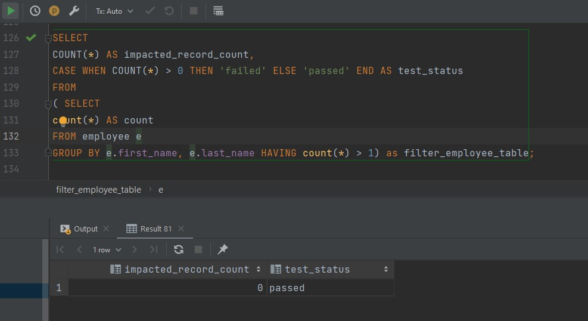
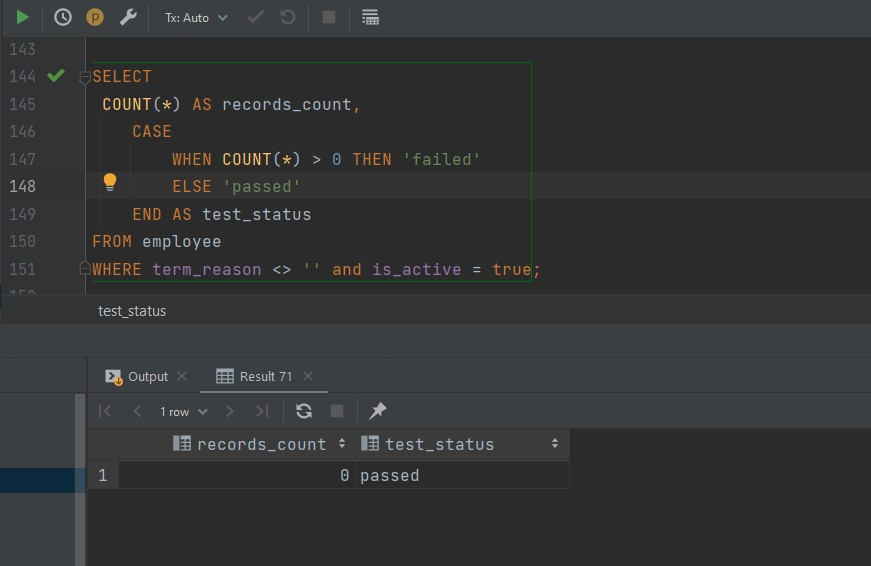
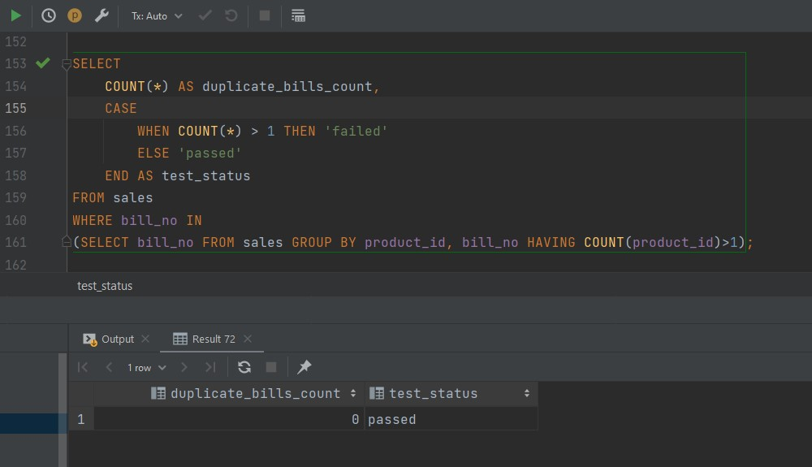
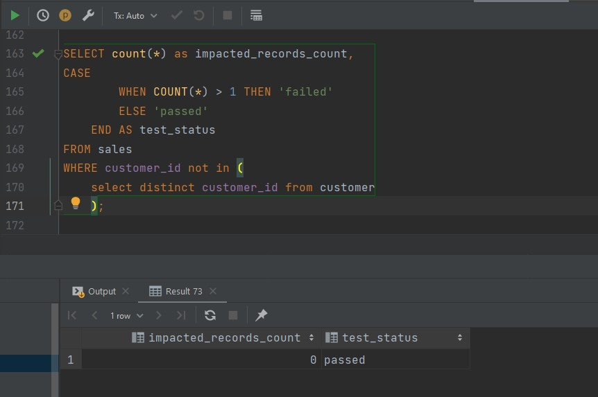
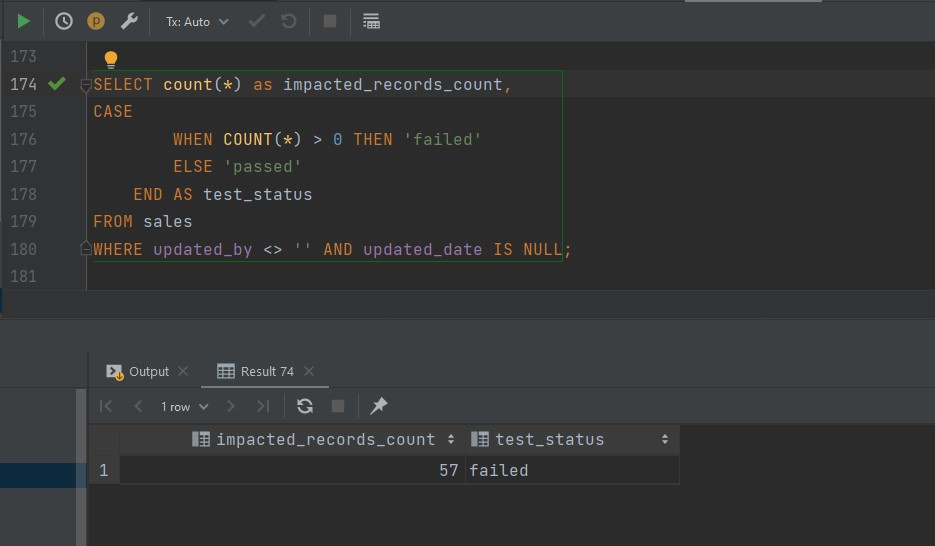
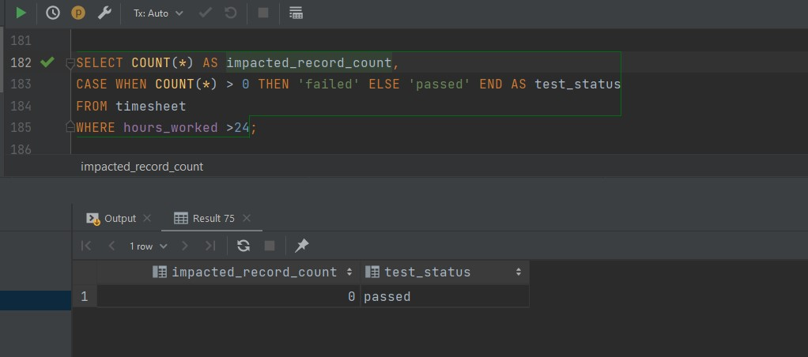
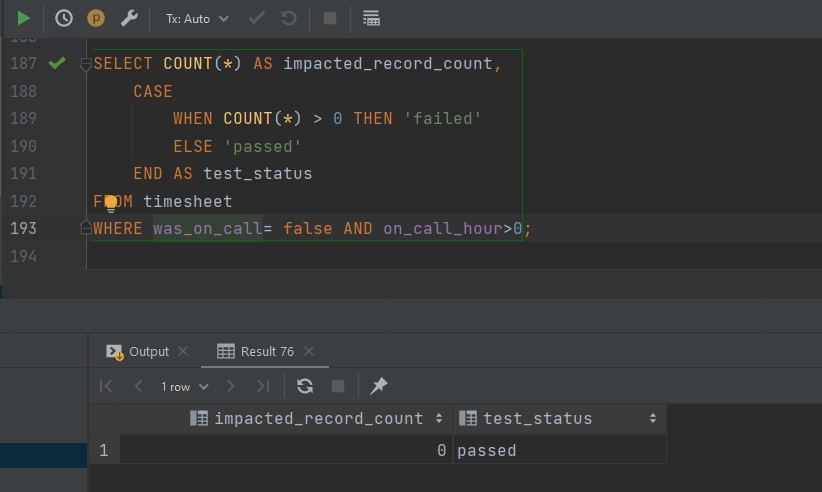
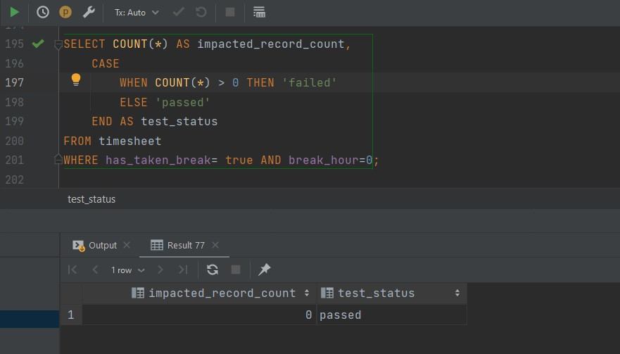
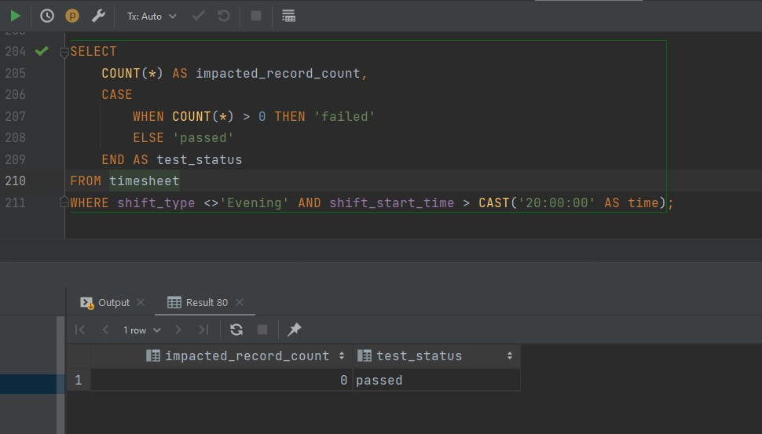

# Query Based Validation 
We now have to validate the database table that is loaded after the ETL process. It is done by writing query based test cases and validating through the database(or say data warehouse).

The steps for performing validation are listed hereafter.

#### 1. Creating and loading the Tables
We have created the tables for the dataset  [here](https://docs.google.com/spreadsheets/d/1R48AdvpZtd8O4vcIEPLs81vGS29DlK2yxM8UU7r2El4/edit#gid=649449009). We import each individual tables as CSV format and then load them into our database using ```\Copy``` command of postgresql.

The commands to load the tables are:
```psql -d data-validation -U postgres```
```\copy  customer FROM  ' data\customer.csv' delimiter ',' csv header```
```\copy  product FROM  ' data\product.csv' delimiter ',' csv header```
```\copy  sales FROM  ' data\sales.csv' delimiter ',' csv header```
```\copy  timesheet_raw FROM  ' data\timesheet_raw.csv' delimiter ',' csv header```
```\copy  employee_raw FROM  ' data\employee_raw.csv' delimiter ',' csv header```
```\copy  employee FROM  ' data\employee.csv' delimiter ',' csv header```
```\copy  timesheet FROM  ' data\timesheet.csv' delimiter ',' csv header```

The DDL queries are [here](https://github.com/nischalbadal/data-validation-leapfrog/blob/day-1/sql/validation-queries.sql).
###### NOTE: The sheets name and the table name are maintained same to avoid any further complexities while importing the data.

## Data Validation Queries
After the tables are created and loaded with the data, we now write the validation test cases. All of the test cases performed are illustrated below:

#### 1. Check if a single employee is listed twice with multiple ids.
```sql
SELECT
COUNT(*) AS impacted_record_count,
CASE WHEN COUNT(*) > 0 THEN 'failed' ELSE 'passed' END AS test_status
FROM
( SELECT
count(*) AS count
FROM employee e
GROUP BY e.first_name, e.last_name HAVING count(*) > 1) as filter_employee_table;
```


#### 2. Check if part time employees are assigned other fte_status.
```sql
SELECT
    COUNT(*) AS records_count,
    CASE
        WHEN COUNT(*) > 0 THEN 'failed'
        ELSE 'passed'
    END AS test_status
FROM employee
WHERE fte<1 and fte_status='Full Time';
```


#### 3. Check if termed employees are marked as active.

```sql
SELECT
 COUNT(*) AS records_count,
    CASE
        WHEN COUNT(*) > 0 THEN 'failed'
        ELSE 'passed'
    END AS test_status
FROM employee
WHERE term_reason <> '' and is_active = true;
```


#### 4. Check if the same product is listed more than once in a single bill.
```sql
SELECT
    COUNT(*) AS duplicate_bills_count,
    CASE
        WHEN COUNT(*) > 1 THEN 'failed'
        ELSE 'passed'
    END AS test_status
FROM sales
WHERE bill_no IN
(SELECT bill_no FROM sales GROUP BY product_id, bill_no HAVING COUNT(product_id)>1);
```


#### 5. Check if the customer_id in the sales table does not exist in the customer table.
```sql
SELECT count(*) as impacted_records_count,
CASE
        WHEN COUNT(*) > 1 THEN 'failed'
        ELSE 'passed'
    END AS test_status
FROM sales
WHERE customer_id not in (
    select distinct customer_id from customer
    );
```


#### 6. Check if there are any records where updated_by is not empty but updated_date is empty.
```sql
SELECT count(*) as impacted_records_count,
CASE
        WHEN COUNT(*) > 0 THEN 'failed'
        ELSE 'passed'
    END AS test_status
FROM sales
WHERE updated_by <> '' and updated_date is null;
```


#### 7. Check if there are any hours worked that are greater than 24 hours.
```sql
SELECT COUNT(*) AS impacted_record_count,
CASE WHEN COUNT(*) > 0 THEN 'failed' ELSE 'passed' END AS test_status
FROM timesheet
WHERE hours_worked >24;
```


#### 8. Check if non on-call employees are set as on-call.
```sql
SELECT COUNT(*) AS impacted_record_count,
    CASE
        WHEN COUNT(*) > 0 THEN 'failed'
        ELSE 'passed'
    END AS test_status
FROM timesheet
WHERE was_on_call= false AND on_call_hour>0;
```


#### 9. Check if the break is true for employees who have not taken a break at all.
```sql
SELECT COUNT(*) AS impacted_record_count,
    CASE
        WHEN COUNT(*) > 0 THEN 'failed'
        ELSE 'passed'
    END AS test_status
FROM timesheet
WHERE has_taken_break= true AND break_hour=0;
select * from timesheet;
```


#### 10. Check if the night shift is not assigned to the employees working on the night shift.
```sql
SELECT
    COUNT(*) AS impacted_record_count,
    CASE
        WHEN COUNT(*) > 0 THEN 'failed'
        ELSE 'passed'
    END AS test_status
FROM timesheet
WHERE shift_type <>'Evening' AND shift_start_time > CAST('20:00:00' AS time);
```


#### In this way, data validation can be done using SQL Queries as test cases.